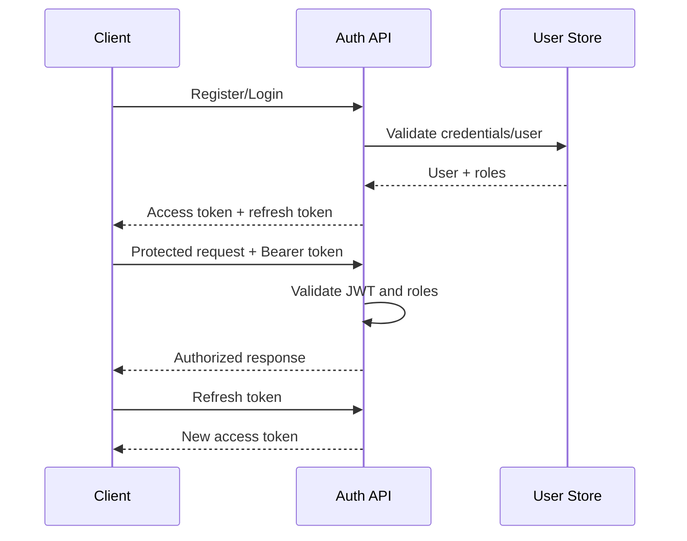

# Authentication and Authorization Flow

```mermaid
sequenceDiagram
 participant C as Client
 participant A as Auth API
 participant U as User Store
 C->>A: Register/Login
 A->>U: Validate credentials/user
 U-->>A: User + roles
 A-->>C: Access token + refresh token
 C->>A: Protected request + Bearer token
 A->>A: Validate JWT and roles
 A-->>C: Authorized response
 C->>A: Refresh token
 A-->>C: New access token
```

OTP is a future extension and is not required by the current authentication implementation.
