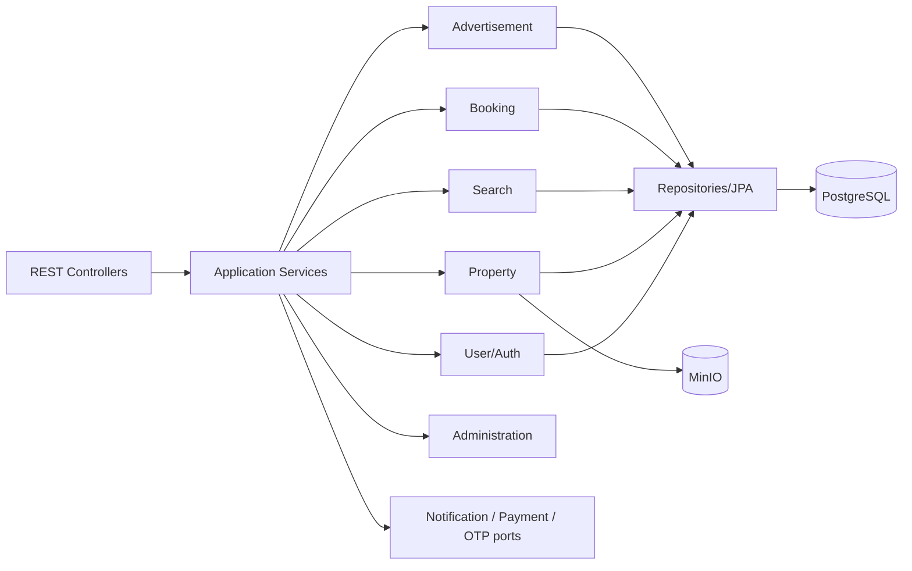

# Backend Module Architecture

```mermaid
flowchart LR
 API[REST Controllers] --> APP[Application Services]
 APP --> USER[User/Auth]
 APP --> PROPERTY[Property]
 APP --> SEARCH[Search]
 APP --> BOOKING[Booking]
 APP --> ADS[Advertisement]
 APP --> ADMIN[Administration]
 USER --> DATA[Repositories/JPA]
 PROPERTY --> DATA
 SEARCH --> DATA
 BOOKING --> DATA
 ADS --> DATA
 DATA --> PG[(PostgreSQL)]
 PROPERTY --> MINIO[(MinIO)]
 APP --> SUPPORT[Notification / Payment / OTP ports]
```
