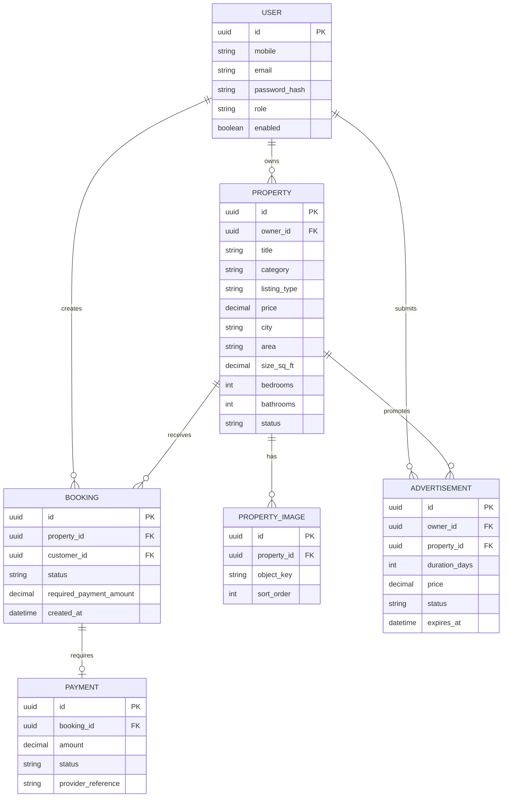

# Database ERD

```mermaid
erDiagram
 USER ||--o{ PROPERTY : owns
 USER ||--o{ BOOKING : creates
 PROPERTY ||--o{ PROPERTY_IMAGE : has
 PROPERTY ||--o{ BOOKING : receives
 USER ||--o{ ADVERTISEMENT : submits
 PROPERTY ||--o{ ADVERTISEMENT : promotes
 BOOKING ||--o| PAYMENT : requires
 USER { uuid id PK string mobile string email string password_hash string role boolean enabled }
 PROPERTY { uuid id PK uuid owner_id FK string title string category string listing_type decimal price string city string area decimal size_sq_ft int bedrooms int bathrooms string status }
 PROPERTY_IMAGE { uuid id PK uuid property_id FK string object_key int sort_order }
 BOOKING { uuid id PK uuid property_id FK uuid customer_id FK string status decimal required_payment_amount datetime created_at }
 ADVERTISEMENT { uuid id PK uuid owner_id FK uuid property_id FK int duration_days decimal price string status datetime expires_at }
 PAYMENT { uuid id PK uuid booking_id FK decimal amount string status string provider_reference }
```
