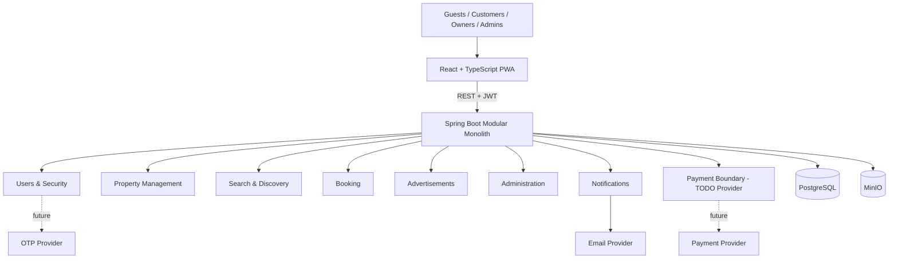

# High-Level Architecture

```mermaid
flowchart TB
  U[Guests / Customers / Owners / Admins] --> FE[React + TypeScript PWA]
  FE -->|REST + JWT| API[Spring Boot Modular Monolith]
  API --> AUTH[Users & Security]
  API --> PROP[Property Management]
  API --> SEARCH[Search & Discovery]
  API --> BOOK[Booking]
  API --> ADS[Advertisements]
  API --> ADMIN[Administration]
  API --> NOTIFY[Notifications]
  API --> PAY[Payment Boundary - TODO Provider]
  API --> DB[(PostgreSQL)]
  API --> OBJ[(MinIO)]
  NOTIFY --> EMAIL[Email Provider]
  PAY -. future .-> PSP[Payment Provider]
  AUTH -. future .-> OTP[OTP Provider]
```

The backend remains a modular monolith. Payment and OTP provider integrations are explicit extension points, not assumed implementations.
