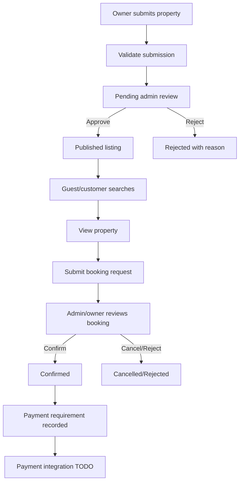

# Business Process

```mermaid
flowchart TD
  A[Owner submits property] --> B[Validate submission]
  B --> C[Pending admin review]
  C -->|Approve| D[Published listing]
  C -->|Reject| E[Rejected with reason]
  D --> F[Guest/customer searches]
  F --> G[View property]
  G --> H[Submit booking request]
  H --> I[Admin/owner reviews booking]
  I -->|Confirm| J[Confirmed]
  I -->|Cancel/Reject| K[Cancelled/Rejected]
  J --> L[Payment requirement recorded]
  L --> M[Payment integration TODO]
```
